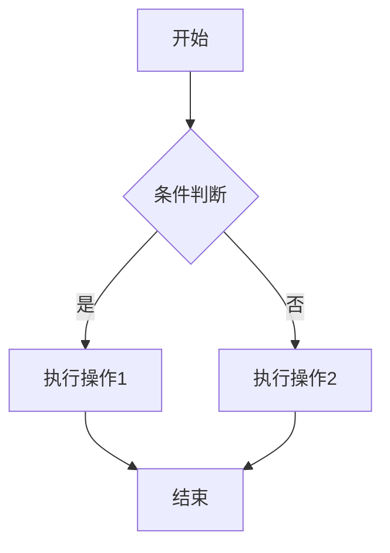

# 技术架构设计文档

## 1. 架构概览

### 1.1 设计原则

- **SOLID原则**：单一职责、开闭原则、里氏替换、接口隔离、依赖倒置
- **高内聚低耦合**：模块内部紧密相关，模块间松散耦合
- **依赖注入**：核心依赖通过接口注入，便于测试和替换
- **插件化架构**：支持功能扩展，如多语言解析器、图表生成器等

### 1.2 分层架构

```
┌─────────────────────────────────────────────────────┐
│              Presentation Layer (UI)                │
│  ┌──────────────┐  ┌──────────────┐  ┌──────────┐  │
│  │  MainWindow  │  │  Dialogs     │  │  Widgets │  │
│  └──────────────┘  └──────────────┘  └──────────┘  │
├─────────────────────────────────────────────────────┤
│            Application Layer (Services)             │
│  ┌──────────────┐  ┌──────────────┐  ┌──────────┐  │
│  │ProjectService│  │AnalysisService│ │SearchSvc │  │
│  └──────────────┘  └──────────────┘  └──────────┘  │
├─────────────────────────────────────────────────────┤
│              Domain Layer (Core Logic)              │
│  ┌──────────────┐  ┌──────────────┐  ┌──────────┐  │
│  │ CodeParser   │  │AIService     │  │DiagramGen│  │
│  └──────────────┘  └──────────────┘  └──────────┘  │
│  ┌──────────────┐  ┌──────────────┐  ┌──────────┐  │
│  │KnowledgeMgr  │  │Recommender   │  │VersionMgr│  │
│  └──────────────┘  └──────────────┘  └──────────┘  │
├─────────────────────────────────────────────────────┤
│          Infrastructure Layer (Foundation)          │
│  ┌──────────────┐  ┌──────────────┐  ┌──────────┐  │
│  │ Database     │  │FileSystem    │  │ Network  │  │
│  └──────────────┘  └──────────────┘  └──────────┘  │
│  ┌──────────────┐  ┌──────────────┐  ┌──────────┐  │
│  │ Logger       │  │ConfigManager │  │ Cache    │  │
│  └──────────────┘  └──────────────┘  └──────────┘  │
└─────────────────────────────────────────────────────┘
```

---

## 2. 核心模块设计

### 2.1 项目管理模块

#### 2.1.1 模块职责

- 项目的创建、打开、关闭、删除
- 项目配置管理
- 项目文件扫描和监控
- 项目元数据管理

#### 2.1.2 类设计

```cpp
/**
 * @file projectmanager.h
 * @brief 项目管理器，负责项目的生命周期管理
 */

class IProjectManager {
public:
    virtual ~IProjectManager() = default;
    
    virtual bool createProject(const QString& name, const QString& path) = 0;
    virtual bool openProject(int projectId) = 0;
    virtual bool closeProject() = 0;
    virtual bool deleteProject(int projectId) = 0;
    
    virtual ProjectInfo getProjectInfo(int projectId) const = 0;
    virtual QVector<ProjectInfo> getAllProjects() const = 0;
    virtual int getCurrentProjectId() const = 0;
    
    virtual void scanProjectFiles() = 0;
    virtual void rescanProjectFiles() = 0;
    
signals:
    virtual void projectCreated(int projectId) = 0;
    virtual void projectOpened(int projectId) = 0;
    virtual void projectClosed(int projectId) = 0;
    virtual void scanProgressChanged(int current, int total) = 0;
};

class ProjectManager : public IProjectManager {
    Q_OBJECT
public:
    static ProjectManager& instance();
    
    bool createProject(const QString& name, const QString& path) override;
    bool openProject(int projectId) override;
    bool closeProject() override;
    bool deleteProject(int projectId) override;
    
    ProjectInfo getProjectInfo(int projectId) const override;
    QVector<ProjectInfo> getAllProjects() const override;
    int getCurrentProjectId() const override;
    
    void scanProjectFiles() override;
    void rescanProjectFiles() override;
    
private:
    ProjectManager();
    ~ProjectManager();
    
    void detectProjectLanguage(const QString& path);
    void detectProjectFramework(const QString& path);
    void buildFileTree(const QString& path);
    QStringList filterFiles(const QStringList& files);
    bool saveProjectToDatabase(const ProjectInfo& project);
    bool updateProjectInDatabase(const ProjectInfo& project);
    
    int m_currentProjectId;
    QMap<int, ProjectInfo> m_projects;
    QFileSystemWatcher* m_fileWatcher;
};

/**
 * @brief 项目信息结构
 */
struct ProjectInfo {
    int id;
    QString name;
    QString path;
    QString description;
    QString language;
    QString framework;
    QString status;
    QDateTime createTime;
    QDateTime updateTime;
    
    QVector<FileInfo> files;
    QVector<ModuleInfo> modules;
};

/**
 * @brief 文件信息结构
 */
struct FileInfo {
    int id;
    int projectId;
    QString filePath;
    QString fileName;
    QString fileType;
    QString relativePath;
    int lineCount;
    QString language;
    QString status;
    QDateTime createTime;
};

/**
 * @brief 模块信息结构
 */
struct ModuleInfo {
    int id;
    int projectId;
    QString moduleName;
    QString modulePath;
    QString description;
    QString aiAnalysis;
};
```

#### 2.1.3 实现要点

**文件扫描策略**：
```cpp
void ProjectManager::scanProjectFiles() {
    QStringList allFiles;
    
    QDirIterator it(m_currentProject.path, 
                    QDir::Files | QDir::NoDotAndDotDot,
                    QDirIterator::Subdirectories);
    
    while (it.hasNext()) {
        QString filePath = it.next();
        if (shouldIncludeFile(filePath)) {
            allFiles.append(filePath);
        }
    }
    
    emit scanProgressChanged(0, allFiles.size());
    
    for (int i = 0; i < allFiles.size(); ++i) {
        processFile(allFiles[i]);
        emit scanProgressChanged(i + 1, allFiles.size());
    }
}

bool ProjectManager::shouldIncludeFile(const QString& filePath) {
    QFileInfo fileInfo(filePath);
    QString suffix = fileInfo.suffix().toLower();
    
    QStringList includeExtensions = {
        "cpp", "h", "hpp", "c", "cc", "cxx",
        "py", "java", "js", "ts", "go", "rs"
    };
    
    QStringList excludeDirs = {
        "node_modules", "venv", ".git", "build", 
        "dist", "__pycache__", ".idea", "cmake-build-debug"
    };
    
    if (!includeExtensions.contains(suffix)) {
        return false;
    }
    
    for (const QString& excludeDir : excludeDirs) {
        if (filePath.contains("/" + excludeDir + "/")) {
            return false;
        }
    }
    
    return true;
}
```

---

### 2.2 代码解析模块

#### 2.2.1 模块职责

- 解析多种编程语言的代码
- 提取函数、类、模块等信息
- 构建代码结构树
- 提取依赖关系

#### 2.2.2 类设计

```cpp
/**
 * @file codeparser.h
 * @brief 代码解析器接口和实现
 */

class ICodeParser {
public:
    virtual ~ICodeParser() = default;
    
    virtual bool canParse(const QString& language) const = 0;
    virtual ParseResult parseFile(const QString& filePath) = 0;
    virtual ParseResult parseCode(const QString& code, const QString& language) = 0;
    
    virtual QStringList getSupportedLanguages() const = 0;
};

struct ParseResult {
    bool success;
    QString errorMessage;
    
    QVector<FunctionInfo> functions;
    QVector<ClassInfo> classes;
    QVector<ModuleInfo> modules;
    QVector<ImportInfo> imports;
    QVector<VariableInfo> globalVariables;
};

struct FunctionInfo {
    QString name;
    QString fullName;
    QString signature;
    QString returnType;
    QVector<ParameterInfo> parameters;
    QString body;
    int lineStart;
    int lineEnd;
    int complexity;
    QString scope;
    QStringList modifiers;
};

struct ClassInfo {
    QString name;
    QString fullName;
    QStringList baseClasses;
    QVector<FunctionInfo> methods;
    QVector<VariableInfo> memberVariables;
    QString accessModifier;
    int lineStart;
    int lineEnd;
};

struct ParameterInfo {
    QString name;
    QString type;
    QString defaultValue;
    bool isOptional;
};

struct ImportInfo {
    QString moduleName;
    QString alias;
    QStringList importedItems;
    bool isRelative;
};

class CppParser : public ICodeParser {
public:
    bool canParse(const QString& language) const override {
        return language == "cpp" || language == "c" || 
               language == "h" || language == "hpp";
    }
    
    ParseResult parseFile(const QString& filePath) override;
    ParseResult parseCode(const QString& code, const QString& language) override;
    
    QStringList getSupportedLanguages() const override {
        return {"cpp", "c", "h", "hpp", "cc", "cxx"};
    }
    
private:
    bool extractFunctions(const QString& code, QVector<FunctionInfo>& functions);
    bool extractClasses(const QString& code, QVector<ClassInfo>& classes);
    bool extractIncludes(const QString& code, QVector<ImportInfo>& imports);
    QString removeComments(const QString& code);
    int calculateComplexity(const QString& functionBody);
};

class PythonParser : public ICodeParser {
public:
    bool canParse(const QString& language) const override {
        return language == "py";
    }
    
    ParseResult parseFile(const QString& filePath) override;
    ParseResult parseCode(const QString& code, const QString& language) override;
    
    QStringList getSupportedLanguages() const override {
        return {"py"};
    }
    
private:
    bool extractFunctions(const QString& code, QVector<FunctionInfo>& functions);
    bool extractClasses(const QString& code, QVector<ClassInfo>& classes);
    bool extractImports(const QString& code, QVector<ImportInfo>& imports);
};

class ParserFactory {
public:
    static ICodeParser* createParser(const QString& language);
    static QStringList getAllSupportedLanguages();
    
private:
    static QMap<QString, ICodeParser*> m_parsers;
    static void initializeParsers();
};
```

#### 2.2.3 解析策略

**初期方案：正则表达式 + AI辅助**

```cpp
ParseResult CppParser::parseCode(const QString& code, const QString& language) {
    ParseResult result;
    QString cleanCode = removeComments(code);
    
    QString funcPattern = R"(
        (?:template\s*<[^>]*>\s*)?
        (?:static\s+|virtual\s+|inline\s+)*
        (?:(?:const\s+)?\w+(?:\s*::\s*\w+)*(?:\s*[*&])+)\s+
        (\w+)\s*
        \(([^)]*)\)
        (?:\s*const\s*)?
        (?:\s*override\s*)?
        (?:\s*final\s*)?
        \s*\{
    )";
    
    QRegularExpression regex(funcPattern, 
                              QRegularExpression::MultilineOption |
                              QRegularExpression::ExtendedPatternSyntax);
    
    QRegularExpressionMatchIterator it = regex.globalMatch(cleanCode);
    
    while (it.hasNext()) {
        QRegularExpressionMatch match = it.next();
        FunctionInfo func;
        func.name = match.captured(1);
        func.signature = match.captured(0).trimmed();
        func.parameters = parseParameters(match.captured(2));
        
        result.functions.append(func);
    }
    
    result.success = true;
    return result;
}
```

**后期方案：集成tree-sitter**

```cpp
class TreeSitterParser : public ICodeParser {
public:
    TreeSitterParser(const QString& language);
    ~TreeSitterParser();
    
    ParseResult parseCode(const QString& code, const QString& language) override;
    
private:
    TSLanguage* m_language;
    TSParser* m_parser;
    
    void initParser(const QString& language);
    void walkTree(TSNode node, ParseResult& result, const QString& code);
    FunctionInfo extractFunction(TSNode node, const QString& code);
    ClassInfo extractClass(TSNode node, const QString& code);
};
```

---

### 2.3 AI分析引擎

#### 2.3.1 模块职责

- 协调AI分析任务
- 管理分析队列
- 处理AI响应
- 优化AI调用策略

#### 2.3.2 类设计

```cpp
/**
 * @file analysisengine.h
 * @brief AI分析引擎，负责协调代码分析任务
 */

class IAnalysisEngine : public QObject {
    Q_OBJECT
public:
    virtual ~IAnalysisEngine() = default;
    
    virtual void analyzeProject(int projectId) = 0;
    virtual void analyzeFile(int fileId) = 0;
    virtual void analyzeFunction(int functionId) = 0;
    virtual void analyzeBatch(const QVector<int>& ids, AnalysisType type) = 0;
    
    virtual void pauseAnalysis() = 0;
    virtual void resumeAnalysis() = 0;
    virtual void cancelAnalysis() = 0;
    
    virtual AnalysisProgress getProgress() const = 0;
    virtual AnalysisStatus getStatus() const = 0;
    
signals:
    void progressChanged(const AnalysisProgress& progress);
    void analysisCompleted(const AnalysisResult& result);
    void analysisFailed(const QString& error, int targetId);
    void taskStarted(int taskId);
    void taskFinished(int taskId);
};

enum class AnalysisType {
    File,
    Function,
    Class,
    Module,
    Project
};

enum class AnalysisStatus {
    Idle,
    Running,
    Paused,
    Cancelled
};

struct AnalysisProgress {
    int totalTasks;
    int completedTasks;
    int failedTasks;
    int currentTaskId;
    QString currentTaskDescription;
    float percentage;
    QDateTime startTime;
    QDateTime estimatedEndTime;
};

struct AnalysisResult {
    int targetId;
    AnalysisType type;
    bool success;
    QString analysis;
    QString error;
    QDateTime timestamp;
};

struct AnalysisTask {
    int id;
    int targetId;
    AnalysisType type;
    QString targetPath;
    QString code;
    AnalysisStatus status;
    int retryCount;
    QDateTime createTime;
    QDateTime startTime;
    QDateTime endTime;
};

class AnalysisEngine : public IAnalysisEngine {
    Q_OBJECT
public:
    static AnalysisEngine& instance();
    
    void analyzeProject(int projectId) override;
    void analyzeFile(int fileId) override;
    void analyzeFunction(int functionId) override;
    void analyzeBatch(const QVector<int>& ids, AnalysisType type) override;
    
    void pauseAnalysis() override;
    void resumeAnalysis() override;
    void cancelAnalysis() override;
    
    AnalysisProgress getProgress() const override;
    AnalysisStatus getStatus() const override;
    
private:
    AnalysisEngine();
    ~AnalysisEngine();
    
    void processQueue();
    void processTask(const AnalysisTask& task);
    void handleAIResponse(QNetworkReply* reply, int taskId);
    void scheduleNextTask();
    void updateProgress();
    
    QString buildPrompt(const AnalysisTask& task);
    bool parseAIResponse(const QString& response, AnalysisResult& result);
    bool saveAnalysisResult(const AnalysisResult& result);
    
    QQueue<AnalysisTask> m_taskQueue;
    QMap<int, AnalysisTask> m_activeTasks;
    AnalysisStatus m_status;
    AnalysisProgress m_progress;
    
    QThread* m_workerThread;
    QTimer* m_progressTimer;
    
    int m_maxConcurrentTasks;
    int m_maxRetryCount;
};
```

#### 2.3.3 批量分析策略

```cpp
void AnalysisEngine::analyzeProject(int projectId) {
    ProjectInfo project = ProjectManager::instance().getProjectInfo(projectId);
    
    QVector<AnalysisTask> tasks;
    
    for (const FileInfo& file : project.files) {
        AnalysisTask task;
        task.targetId = file.id;
        task.type = AnalysisType::File;
        task.targetPath = file.filePath;
        task.status = AnalysisStatus::Pending;
        tasks.append(task);
    }
    
    std::sort(tasks.begin(), tasks.end(), [](const AnalysisTask& a, const AnalysisTask& b) {
        QFileInfo fiA(a.targetPath);
        QFileInfo fiB(b.targetPath);
        return fiA.size() < fiB.size();
    });
    
    for (const AnalysisTask& task : tasks) {
        m_taskQueue.enqueue(task);
    }
    
    m_progress.totalTasks = tasks.size();
    m_progress.completedTasks = 0;
    m_progress.startTime = QDateTime::currentDateTime();
    
    m_status = AnalysisStatus::Running;
    processQueue();
}

void AnalysisEngine::processQueue() {
    if (m_status != AnalysisStatus::Running) {
        return;
    }
    
    while (m_activeTasks.size() < m_maxConcurrentTasks && !m_taskQueue.isEmpty()) {
        AnalysisTask task = m_taskQueue.dequeue();
        task.status = AnalysisStatus::Running;
        task.startTime = QDateTime::currentDateTime();
        
        m_activeTasks[task.id] = task;
        processTask(task);
    }
}

void AnalysisEngine::processTask(const AnalysisTask& task) {
    QString prompt = buildPrompt(task);
    
    AIServiceManager::instance().analyzeCode(prompt);
    
    emit taskStarted(task.id);
}

QString AnalysisEngine::buildPrompt(const AnalysisTask& task) {
    QString template_;
    
    switch (task.type) {
        case AnalysisType::Function:
            template_ = FUNCTION_ANALYSIS_TEMPLATE;
            break;
        case AnalysisType::File:
            template_ = FILE_ANALYSIS_TEMPLATE;
            break;
        case AnalysisType::Class:
            template_ = CLASS_ANALYSIS_TEMPLATE;
            break;
        case AnalysisType::Module:
            template_ = MODULE_ANALYSIS_TEMPLATE;
            break;
        default:
            template_ = GENERAL_ANALYSIS_TEMPLATE;
    }
    
    return template_.arg(task.code);
}
```

#### 2.3.4 AI提示词模板

```cpp
const QString FUNCTION_ANALYSIS_TEMPLATE = R"(
你是一位资深的代码分析专家。请分析以下函数，并提供详细的技术说明。

函数代码：
```{language}
{code}
```

请按以下JSON格式返回分析结果：
{{
  "function_name": "函数名称",
  "signature": "完整函数签名",
  "return_type": "返回值类型",
  "parameters": [
    {{
      "name": "参数名",
      "type": "参数类型",
      "description": "参数用途说明",
      "is_optional": false
    }}
  ],
  "description": "函数功能描述（简洁明了，不超过100字）",
  "detailed_description": "详细功能说明（包括算法思路、实现细节）",
  "algorithm": "算法思路说明（如果有）",
  "time_complexity": "时间复杂度分析",
  "space_complexity": "空间复杂度分析",
  "usage_example": "使用示例代码",
  "notes": [
    "注意事项1",
    "注意事项2"
  ],
  "edge_cases": [
    "边界情况1",
    "边界情况2"
  ],
  "related_patterns": ["涉及的设计模式"],
  "dependencies": ["依赖的其他函数或模块"],
  "side_effects": "副作用说明（如果有）"
}}

要求：
1. 分析要准确、专业，避免模糊表述
2. 复杂度分析要基于实际算法逻辑
3. 使用示例要完整、可运行
4. 注意事项要实用，帮助使用者避坑
5. 所有描述使用中文
)";

const QString FILE_ANALYSIS_TEMPLATE = R"(
你是一位资深的代码架构师。请分析以下代码文件，提供文件级别的技术说明。

文件路径：{file_path}
文件代码：
```{language}
{code}
```

请按以下JSON格式返回分析结果：
{{
  "file_summary": "文件功能概述（不超过150字）",
  "main_responsibilities": [
    "主要职责1",
    "主要职责2"
  ],
  "key_functions": [
    {{
      "name": "函数名",
      "description": "功能描述",
      "importance": "high/medium/low"
    }}
  ],
  "key_classes": [
    {{
      "name": "类名",
      "description": "功能描述",
      "importance": "high/medium/low"
    }}
  ],
  "dependencies": {
    "internal": ["内部依赖模块"],
    "external": ["外部依赖库"]
  },
  "design_patterns": ["使用的设计模式"],
  "code_quality": {{
    "readability": "可读性评分(1-10)",
    "maintainability": "可维护性评分(1-10)",
    "testability": "可测试性评分(1-10)",
    "issues": ["存在的问题"]
  }},
  "suggestions": ["改进建议"]
}}

要求：
1. 从架构角度分析文件职责
2. 识别关键组件和它们的关系
3. 评估代码质量
4. 提供实用的改进建议
)";
```

---

### 2.4 图表生成模块

#### 2.4.1 模块职责

- 分析代码结构
- 生成各类图表的Mermaid代码
- 优化图表展示效果
- 支持图表导出

#### 2.4.2 类设计

```cpp
/**
 * @file diagramgenerator.h
 * @brief 图表生成器，负责生成各类可视化图表
 */

class IDiagramGenerator {
public:
    virtual ~IDiagramGenerator() = default;
    
    virtual QString generateArchitectureDiagram(int projectId) = 0;
    virtual QString generateModuleDiagram(int projectId) = 0;
    virtual QString generateFlowChart(int functionId) = 0;
    virtual QString generateSequenceDiagram(int functionId) = 0;
    virtual QString generateClassDiagram(int projectId) = 0;
    virtual QString generateDependencyGraph(int projectId) = 0;
};

struct DiagramData {
    QString diagramType;
    QString title;
    QVector<Node> nodes;
    QVector<Edge> edges;
    QString mermaidCode;
};

struct Node {
    QString id;
    QString label;
    QString type;
    QString shape;
    QString color;
    QString tooltip;
};

struct Edge {
    QString source;
    QString target;
    QString label;
    QString style;
    QString color;
};

class DiagramGenerator : public IDiagramGenerator {
public:
    static DiagramGenerator& instance();
    
    QString generateArchitectureDiagram(int projectId) override;
    QString generateModuleDiagram(int projectId) override;
    QString generateFlowChart(int functionId) override;
    QString generateSequenceDiagram(int functionId) override;
    QString generateClassDiagram(int projectId) override;
    QString generateDependencyGraph(int projectId) override;
    
private:
    DiagramGenerator();
    
    QString buildMermaidCode(const DiagramData& data);
    void analyzeDependencies(int projectId, QMap<QString, QStringList>& dependencies);
    void analyzeCallHierarchy(int functionId, QVector<CallNode>& callTree);
    void analyzeClassHierarchy(int projectId, QVector<ClassNode>& classTree);
    
    QString formatMermaidNode(const Node& node);
    QString formatMermaidEdge(const Edge& edge);
    
    void simplifyDiagram(DiagramData& data, int maxNodes);
    void layoutNodes(DiagramData& data);
};
```

#### 2.4.3 图表生成实现

```cpp
QString DiagramGenerator::generateArchitectureDiagram(int projectId) {
    ProjectInfo project = ProjectManager::instance().getProjectInfo(projectId);
    
    DiagramData diagram;
    diagram.diagramType = "architecture";
    diagram.title = project.name + " 架构图";
    
    QMap<QString, QStringList> dependencies;
    analyzeDependencies(projectId, dependencies);
    
    QMap<QString, int> moduleNodeMap;
    int nodeIndex = 0;
    
    for (const QString& module : dependencies.keys()) {
        if (!moduleNodeMap.contains(module)) {
            Node node;
            node.id = QString("M%1").arg(nodeIndex);
            node.label = module;
            node.type = "module";
            node.shape = "rect";
            diagram.nodes.append(node);
            moduleNodeMap[module] = nodeIndex++;
        }
        
        for (const QString& dep : dependencies[module]) {
            if (!moduleNodeMap.contains(dep)) {
                Node node;
                node.id = QString("M%1").arg(nodeIndex);
                node.label = dep;
                node.type = "module";
                node.shape = "rect";
                diagram.nodes.append(node);
                moduleNodeMap[dep] = nodeIndex++;
            }
            
            Edge edge;
            edge.source = QString("M%1").arg(moduleNodeMap[module]);
            edge.target = QString("M%1").arg(moduleNodeMap[dep]);
            edge.style = "solid";
            diagram.edges.append(edge);
        }
    }
    
    simplifyDiagram(diagram, 50);
    
    return buildMermaidCode(diagram);
}

QString DiagramGenerator::buildMermaidCode(const DiagramData& data) {
    QString mermaid;
    
    if (data.diagramType == "architecture" || 
        data.diagramType == "module" ||
        data.diagramType == "dependency") {
        mermaid = "graph TD\n";
    } else if (data.diagramType == "flowchart") {
        mermaid = "flowchart TD\n";
    } else if (data.diagramType == "sequence") {
        mermaid = "sequenceDiagram\n";
    } else if (data.diagramType == "class") {
        mermaid = "classDiagram\n";
    }
    
    mermaid += QString("    %% %1\n").arg(data.title);
    
    for (const Node& node : data.nodes) {
        mermaid += "    " + formatMermaidNode(node) + "\n";
    }
    
    for (const Edge& edge : data.edges) {
        mermaid += "    " + formatMermaidEdge(edge) + "\n";
    }
    
    return mermaid;
}

QString DiagramGenerator::formatMermaidNode(const Node& node) {
    QString shapeStart, shapeEnd;
    
    if (node.shape == "rect") {
        shapeStart = "[";
        shapeEnd = "]";
    } else if (node.shape == "rounded") {
        shapeStart = "(";
        shapeEnd = ")";
    } else if (node.shape == "diamond") {
        shapeStart = "{";
        shapeEnd = "}";
    } else if (node.shape == "circle") {
        shapeStart = "((";
        shapeEnd = "))";
    } else {
        shapeStart = "[";
        shapeEnd = "]";
    }
    
    return QString("%1%2\"%3\"%4").arg(node.id, shapeStart, node.label, shapeEnd);
}

QString DiagramGenerator::formatMermaidEdge(const Edge& edge) {
    QString arrow;
    
    if (edge.style == "solid") {
        arrow = "-->";
    } else if (edge.style == "dashed") {
        arrow = "-.->";
    } else if (edge.style == "thick") {
        arrow = "==>";
    } else {
        arrow = "-->";
    }
    
    if (edge.label.isEmpty()) {
        return QString("%1 %2 %3").arg(edge.source, arrow, edge.target);
    } else {
        return QString("%1 %2|%3| %4").arg(edge.source, arrow, edge.label, edge.target);
    }
}
```

#### 2.4.4 流程图生成

```cpp
QString DiagramGenerator::generateFlowChart(int functionId) {
    FunctionData func = DatabaseManager::instance().getFunctionById(functionId);
    
    QString code = func.codeSnippet;
    if (code.isEmpty()) {
        return "";
    }
    
    QString prompt = QString(R"(
分析以下函数代码，生成Mermaid流程图。

函数代码：
```
%1
```

要求：
1. 使用flowchart TD格式
2. 包含所有关键分支和循环
3. 节点描述要简洁明了
4. 使用中文标注
5. 只返回Mermaid代码，不要其他说明

示例格式：

)").arg(code);
    
    QString aiResponse = AIServiceManager::instance().syncAnalyze(prompt);
    
    QRegularExpression mermaidRegex("```mermaid\n([\\s\\S]*?)\n```");
    QRegularExpressionMatch match = mermaidRegex.match(aiResponse);
    
    if (match.hasMatch()) {
        return match.captured(1);
    }
    
    return aiResponse;
}
```

---

### 2.5 知识管理模块

#### 2.5.1 模块职责

- 知识关联管理
- 智能搜索
- 相似度计算
- 推荐系统

#### 2.5.2 类设计

```cpp
/**
 * @file knowledgemanager.h
 * @brief 知识管理器，负责知识的关联、搜索和推荐
 */

class IKnowledgeManager {
public:
    virtual ~IKnowledgeManager() = default;
    
    virtual void linkKnowledge(int sourceId, int targetId, const QString& relation) = 0;
    virtual bool removeLink(int sourceId, int targetId) = 0;
    virtual QVector<KnowledgeLink> getRelatedKnowledge(int knowledgeId) = 0;
    
    virtual QVector<FunctionData> search(const QString& keyword) = 0;
    virtual QVector<FunctionData> searchByCode(const QString& codeSnippet) = 0;
    virtual QVector<FunctionData> searchByTags(const QStringList& tags) = 0;
    virtual QVector<FunctionData> advancedSearch(const SearchCriteria& criteria) = 0;
    
    virtual QVector<FunctionData> getRecommendations(int functionId, int count = 10) = 0;
    virtual QVector<FunctionData> getSimilarFunctions(int functionId, int count = 10) = 0;
    virtual QVector<FunctionData> getHotFunctions(int count = 10) = 0;
};

struct KnowledgeLink {
    int sourceId;
    int targetId;
    QString relation;
    float strength;
    QDateTime createTime;
};

struct SearchCriteria {
    QString keyword;
    QStringList tags;
    QString projectName;
    QString language;
    QDateTime dateFrom;
    QDateTime dateTo;
    int minComplexity;
    int maxComplexity;
    QString sortBy;
    bool ascending;
};

class KnowledgeManager : public IKnowledgeManager {
public:
    static KnowledgeManager& instance();
    
    void linkKnowledge(int sourceId, int targetId, const QString& relation) override;
    bool removeLink(int sourceId, int targetId) override;
    QVector<KnowledgeLink> getRelatedKnowledge(int knowledgeId) override;
    
    QVector<FunctionData> search(const QString& keyword) override;
    QVector<FunctionData> searchByCode(const QString& codeSnippet) override;
    QVector<FunctionData> searchByTags(const QStringList& tags) override;
    QVector<FunctionData> advancedSearch(const SearchCriteria& criteria) override;
    
    QVector<FunctionData> getRecommendations(int functionId, int count = 10) override;
    QVector<FunctionData> getSimilarFunctions(int functionId, int count = 10) override;
    QVector<FunctionData> getHotFunctions(int count = 10) override;
    
private:
    KnowledgeManager();
    
    float calculateSimilarity(const FunctionData& f1, const FunctionData& f2);
    float calculateCodeSimilarity(const QString& code1, const QString& code2);
    float calculateTextSimilarity(const QString& text1, const QString& text2);
    void buildIndex();
    void updateIndex();
    
    QMap<int, QStringList> m_keywordIndex;
    QMap<QString, QVector<int>> m_tagIndex;
    QMap<int, QStringList> m_codeTokens;
};
```

#### 2.5.3 搜索实现

```cpp
QVector<FunctionData> KnowledgeManager::search(const QString& keyword) {
    QVector<FunctionData> results;
    
    QStringList keywords = keyword.toLower().split(QRegularExpression("\\s+"));
    
    QSqlQuery query;
    QString sql = "SELECT * FROM functions WHERE status = 'active' AND (";
    
    QStringList conditions;
    for (const QString& kw : keywords) {
        conditions << QString("LOWER(function_name) LIKE '%%1%'").arg(kw);
        conditions << QString("LOWER(description) LIKE '%%1%'").arg(kw);
        conditions << QString("LOWER(ai_analysis) LIKE '%%1%'").arg(kw);
        conditions << QString("LOWER(tags) LIKE '%%1%'").arg(kw);
    }
    
    sql += conditions.join(" OR ");
    sql += ") ORDER BY create_time DESC";
    
    if (query.exec(sql)) {
        while (query.next()) {
            FunctionData func;
            func.id = query.value("id").toInt();
            func.key = query.value("function_name").toString();
            func.value = query.value("description").toString();
            results.append(func);
        }
    }
    
    return results;
}

QVector<FunctionData> KnowledgeManager::getSimilarFunctions(int functionId, int count) {
    FunctionData sourceFunc = DatabaseManager::instance().getFunctionById(functionId);
    
    QVector<FunctionData> allFunctions = DatabaseManager::instance().getAllFunctions();
    
    QVector<QPair<float, FunctionData>> scoredFunctions;
    
    for (const FunctionData& func : allFunctions) {
        if (func.id == functionId) continue;
        
        float similarity = calculateSimilarity(sourceFunc, func);
        if (similarity > 0.3) {
            scoredFunctions.append(qMakePair(similarity, func));
        }
    }
    
    std::sort(scoredFunctions.begin(), scoredFunctions.end(),
              [](const auto& a, const auto& b) { return a.first > b.first; });
    
    QVector<FunctionData> results;
    for (int i = 0; i < qMin(count, scoredFunctions.size()); ++i) {
        results.append(scoredFunctions[i].second);
    }
    
    return results;
}

float KnowledgeManager::calculateSimilarity(const FunctionData& f1, const FunctionData& f2) {
    float score = 0.0;
    
    QStringList tags1 = f1.tags.split(",", Qt::SkipEmptyParts);
    QStringList tags2 = f2.tags.split(",", Qt::SkipEmptyParts);
    
    int commonTags = 0;
    for (const QString& tag : tags1) {
        if (tags2.contains(tag)) {
            commonTags++;
        }
    }
    float tagSimilarity = (tags1.isEmpty() || tags2.isEmpty()) ? 0.0 :
                          (float)commonTags / qMax(tags1.size(), tags2.size());
    
    float codeSimilarity = calculateCodeSimilarity(f1.codeSnippet, f2.codeSnippet);
    
    float textSimilarity = calculateTextSimilarity(f1.description, f2.description);
    
    score = tagSimilarity * 0.4 + codeSimilarity * 0.4 + textSimilarity * 0.2;
    
    return score;
}
```

---

## 3. 数据库设计

### 3.1 数据库迁移策略

```cpp
class DatabaseMigration {
public:
    static bool migrateToVersion2();
    static bool migrateToVersion3();
    
private:
    static bool executeSqlFile(const QString& filePath);
    static bool backupDatabase(const QString& backupPath);
    static bool restoreDatabase(const QString& backupPath);
};

bool DatabaseMigration::migrateToVersion2() {
    QString backupPath = DatabaseManager::instance().getDatabasePath() + ".backup";
    
    if (!backupDatabase(backupPath)) {
        Logger::instance().error("数据库备份失败");
        return false;
    }
    
    QSqlDatabase db = DatabaseManager::instance().getDatabase();
    
    if (!db.transaction()) {
        Logger::instance().error("无法开始数据库事务");
        return false;
    }
    
    try {
        QSqlQuery query;
        
        if (!query.exec("ALTER TABLE functions ADD COLUMN project_id INTEGER")) {
            throw std::runtime_error("添加project_id列失败");
        }
        
        if (!query.exec("ALTER TABLE functions ADD COLUMN file_id INTEGER")) {
            throw std::runtime_error("添加file_id列失败");
        }
        
        if (!query.exec("CREATE TABLE projects (...)")) {
            throw std::runtime_error("创建projects表失败");
        }
        
        if (!query.exec("CREATE TABLE files (...)")) {
            throw std::runtime_error("创建files表失败");
        }
        
        if (!query.exec("CREATE INDEX idx_functions_project ON functions(project_id)")) {
            throw std::runtime_error("创建索引失败");
        }
        
        db.commit();
        Logger::instance().info("数据库迁移到版本2成功");
        return true;
        
    } catch (const std::exception& e) {
        db.rollback();
        Logger::instance().error(QString("数据库迁移失败: %1").arg(e.what()));
        restoreDatabase(backupPath);
        return false;
    }
}
```

### 3.2 查询优化

```cpp
class QueryOptimizer {
public:
    static QSqlQuery createOptimizedQuery(const QString& sql);
    static void enableQueryCache(bool enable);
    static void clearQueryCache();
    
private:
    static QMap<QString, QSqlQuery> m_queryCache;
    static bool m_cacheEnabled;
};

QSqlQuery QueryOptimizer::createOptimizedQuery(const QString& sql) {
    if (m_cacheEnabled && m_queryCache.contains(sql)) {
        return m_queryCache[sql];
    }
    
    QSqlQuery query;
    query.prepare(sql);
    query.setForwardOnly(true);
    
    if (m_cacheEnabled) {
        m_queryCache[sql] = query;
    }
    
    return query;
}
```

---

## 4. 性能优化策略

### 4.1 缓存机制

```cpp
class CacheManager {
public:
    static CacheManager& instance();
    
    template<typename T>
    void put(const QString& key, const T& value, int ttlSeconds = 3600);
    
    template<typename T>
    std::optional<T> get(const QString& key);
    
    void remove(const QString& key);
    void clear();
    
private:
    CacheManager();
    
    struct CacheEntry {
        QVariant data;
        QDateTime expireTime;
    };
    
    QMap<QString, CacheEntry> m_cache;
    QMutex m_mutex;
    QTimer* m_cleanupTimer;
    
    void cleanup();
};
```

### 4.2 异步处理

```cpp
class AsyncTaskManager : public QObject {
    Q_OBJECT
public:
    static AsyncTaskManager& instance();
    
    template<typename Func>
    QFuture<typename std::result_of<Func()>::type> runAsync(Func func);
    
    void setMaxThreadCount(int count);
    
private:
    AsyncTaskManager();
    
    QThreadPool* m_threadPool;
};

template<typename Func>
QFuture<typename std::result_of<Func()>::type> 
AsyncTaskManager::runAsync(Func func) {
    return QtConcurrent::run(m_threadPool, func);
}
```

### 4.3 增量分析

```cpp
class IncrementalAnalyzer {
public:
    void markFileChanged(const QString& filePath);
    void markFunctionChanged(int functionId);
    
    QVector<QString> getChangedFiles();
    QVector<int> getChangedFunctions();
    
    void clearChanges();
    
private:
    QSet<QString> m_changedFiles;
    QSet<int> m_changedFunctions;
    QMutex m_mutex;
};
```

---

## 5. 错误处理和日志

### 5.1 异常处理策略

```cpp
enum class ErrorCode {
    Success = 0,
    DatabaseError = 1001,
    FileIOError = 1002,
    ParseError = 1003,
    AIError = 2001,
    NetworkError = 2002,
    InvalidParameter = 3001,
    NotFound = 3002,
    Unknown = 9999
};

class Result<T> {
public:
    Result(T value) : m_value(value), m_errorCode(ErrorCode::Success) {}
    Result(ErrorCode code, const QString& message) 
        : m_errorCode(code), m_errorMessage(message) {}
    
    bool isSuccess() const { return m_errorCode == ErrorCode::Success; }
    bool isError() const { return m_errorCode != ErrorCode::Success; }
    
    T getValue() const { return m_value; }
    ErrorCode getErrorCode() const { return m_errorCode; }
    QString getErrorMessage() const { return m_errorMessage; }
    
private:
    T m_value;
    ErrorCode m_errorCode;
    QString m_errorMessage;
};

template<>
class Result<void> {
public:
    Result() : m_errorCode(ErrorCode::Success) {}
    Result(ErrorCode code, const QString& message) 
        : m_errorCode(code), m_errorMessage(message) {}
    
    bool isSuccess() const { return m_errorCode == ErrorCode::Success; }
    bool isError() const { return m_errorCode != ErrorCode::Success; }
    
    ErrorCode getErrorCode() const { return m_errorCode; }
    QString getErrorMessage() const { return m_errorMessage; }
    
private:
    ErrorCode m_errorCode;
    QString m_errorMessage;
};
```

### 5.2 日志增强

```cpp
class EnhancedLogger : public Logger {
public:
    void logWithCategory(LogLevel level, const QString& category, const QString& message);
    void logPerformance(const QString& operation, qint64 durationMs);
    void logUserAction(const QString& action, const QMap<QString, QString>& params);
    
private:
    void writeToJsonLog(const QJsonObject& logEntry);
    void archiveOldLogs();
};
```

---

## 6. 测试策略

### 6.1 单元测试框架

```cpp
class TestBase : public QObject {
    Q_OBJECT
protected:
    void setUp();
    void tearDown();
    
    QString createTempFile(const QString& content, const QString& extension = ".cpp");
    void removeTempFile(const QString& filePath);
    
    QSqlDatabase createTestDatabase();
    void destroyTestDatabase(QSqlDatabase& db);
};

class CodeParserTest : public TestBase {
    Q_OBJECT
private slots:
    void testParseCppFunction();
    void testParseCppClass();
    void testParsePythonFunction();
    void testParseComplexFunction();
    void testInvalidCode();
};
```

### 6.2 集成测试

```cpp
class IntegrationTest : public TestBase {
    Q_OBJECT
private slots:
    void testProjectWorkflow();
    void testAnalysisWorkflow();
    void testSearchWorkflow();
};
```

---

## 7. 部署和配置

### 7.1 配置管理

```cpp
class ConfigManager {
public:
    static ConfigManager& instance();
    
    void loadConfig();
    void saveConfig();
    
    QVariant get(const QString& key, const QVariant& defaultValue = QVariant());
    void set(const QString& key, const QVariant& value);
    
    struct AIConfig {
        QString provider;
        QString apiKey;
        QString baseUrl;
        QString modelId;
        int maxTokens;
        float temperature;
    };
    
    AIConfig getAIConfig();
    void setAIConfig(const AIConfig& config);
    
private:
    ConfigManager();
    
    QString m_configPath;
    QSettings* m_settings;
    QMap<QString, QVariant> m_cache;
};
```

---

## 8. 总结

本技术架构设计文档详细说明了：

1. **分层架构**：清晰的职责划分，便于维护和扩展
2. **核心模块**：完整的设计和实现方案
3. **数据模型**：扩展的数据库设计，支持复杂功能
4. **性能优化**：缓存、异步、增量分析等策略
5. **质量保证**：错误处理、日志、测试策略

**下一步行动**：
1. 评审架构设计
2. 实现第一阶段功能
3. 建立CI/CD流程
4. 开始测试和优化
